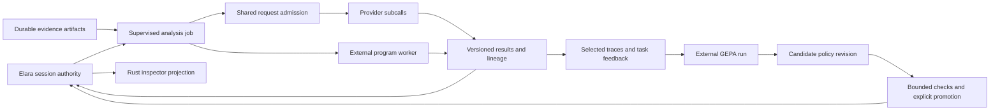

# Research papers for Elara: RLM, GEPA, and harness engineering

Research cutoff: **2026-09-06**. Companion to the [repository and Stencil investigation](harness-ideas-beam-2026-09-06.md). This is research and a set of proposed experiments; it does not change the roadmap or implement the proposals.

**RLM is the strongest additional architecture experiment for Elara. GEPA is a useful way to improve selected harness behavior once there is trustworthy feedback.** I would connect them through a durable evidence service: agents operate on identified artifacts, their work produces attributable traces, and proposed policy changes remain versioned and independently selectable.

The BEAM opportunity is to make that work observable, interruptible, bounded, and recoverable. Cheap processes do not imply cheap model calls, and none of the papers below demonstrates that an Elixir implementation improves model accuracy. The Elara designs in this report are our hypotheses.

## Scope and selection

The investigation covered primary arXiv papers, methods, experimental protocols, limitations, and selected official implementations. The RLM and GEPA repositories were also cloned and inspected; their exact revisions and code findings are in the companion reviews. Research artifacts are temporarily retained under `/tmp/elara-paper-research-2026-09-06/`. No model experiments or downloaded programs were run.

“Popular” is treated as observable attention and recognition, not a claim to an exhaustive citation ranking. On September 6, the official GitHub API reported **5,589 stars for RLM** and **6,434 for GEPA**. These are interest signals, not replications. GEPA's arXiv record identifies an **ICLR 2026 Oral**; the reliability study below identifies **ICML 2026 acceptance**. The landscape review also includes conference-recognized anchors such as CodeAct and ACE. The late-August and September papers are an **emerging watch list**, too new to treat as established findings. [RLM repository metadata](https://api.github.com/repos/alexzhang13/rlm), [GEPA repository metadata](https://api.github.com/repos/gepa-ai/gepa), [GEPA record](https://arxiv.org/abs/2507.19457v2), [reliability record](https://arxiv.org/abs/2602.16666v3)

The search included context engineering, memory, programmatic tool use, coordination, reliability, and harness evolution. Restricting it to the literal phrase “harness engineering” would miss several relevant research lines.

| Reading | Version inspected / date | Why it belongs here |
| --- | --- | --- |
| [Recursive Language Models](https://arxiv.org/abs/2512.24601v3) | v3, May 11, 2026; first submitted Dec. 31, 2025 | External context plus programmatic model subcalls. [Detailed review](rlm-paper-review-2026-09-06.md) |
| [GEPA](https://arxiv.org/abs/2507.19457v2) | v2, Feb. 14, 2026; first submitted July 25, 2025 | Reflective optimization of prompts from execution feedback. [Detailed review](gepa-paper-review-2026-09-06.md) |
| [Combee](https://arxiv.org/abs/2604.04247v1) | v1, Apr. 5, 2026 | Parallel reflection is a concrete scheduling experiment. [Methods and cost caveats](gepa-paper-review-2026-09-06.md) |
| [Towards a Science of Scaling Agent Systems](https://arxiv.org/abs/2512.08296v3) | v3, Apr. 8, 2026 | Evidence for choosing coordination by task structure. |
| [Towards a Science of AI Agent Reliability](https://arxiv.org/abs/2602.16666v3) | v3, June 2, 2026 | Distinguishes task success from repeatability and other reliability properties. |
| [HarnessLens](https://arxiv.org/abs/2608.27311v1) | v1, Aug. 27, 2026 | Candidate-specific verification and trace-based acceptance. |
| [HarnessDev](https://arxiv.org/abs/2609.01437v1) | v1, Sept. 1, 2026 | Tests creation and evolution of runnable harnesses, including transfer. |
| [Harness-of-Harness](https://arxiv.org/abs/2609.01481v1) | v1, Sept. 1, 2026 | Persistent artifact and evidence state across bounded development loops. |

For context and memory, the [landscape review](arxiv-harness-landscape-2026-09-06.md) covers **CodeAct, A-MEM, the Context Engineering survey, ACE, AgentFold, MemRL, SAGE, MemGate, and AgenticRag-R1**, including exact versions, training requirements, and limitations. The RLM review examines a reproduction and typed recursion; the GEPA review covers newer optimization work. These notes supply the wider reading list without treating every paper as a feature to build.

## What changes in the earlier Elara recommendations

The earlier report recommended background evidence preparation, event-driven work, an inspector, and durable workflow state. The papers give these ideas a more concrete use:

| Proposed direction | More specific experiment for Elara |
| --- | --- |
| Background context preparation | Produce immutable, retrievable evidence objects that a context-analysis program can address. |
| Shared workspace evidence | Support bounded searches and transformations over logs, source snapshots, and session history without copying the whole corpus into every request. |
| Durable workflows | Keep the analysis tree, pending jobs, accepted results, and remaining allowance outside any one conversation. |
| Runtime inspector | Show the exact evidence, subcall, context view, and policy revision behind an answer or decision. |
| Live capabilities | Let a candidate policy or tool description have a lifecycle distinct from the active version. |
| Persistent specialists | Wake them for a specific missing fact or changed artifact; require an explicit reason to spend inference. |

This sharpens the original sequence: establish useful evidence objects first, then use a bounded RLM-style job to test their value. A broad agent team or autonomous optimizer is not a prerequisite.

## RLM and GEPA occupy complementary places

RLM supplies an inference pattern; GEPA supplies an improvement procedure. They can be adopted independently. RLM does not require weight training to try, while the RLM paper's post-trained model is a separate result. GEPA's ordinary prompt optimization does not train model weights. [RLM](https://arxiv.org/abs/2512.24601v3), [GEPA](https://arxiv.org/abs/2507.19457v2)

For Elara, I would give them different contracts:

| Design choice | RLM-inspired analysis in Elara | GEPA-inspired improvement of Elara |
| --- | --- | --- |
| Immediate objective | Answer a question about a large, identified body of evidence. | Improve one explicitly selected behavior across example tasks. |
| Input | Artifact handles, the question, allowed operations, and a shared allowance. | Frozen configuration, task examples, outcomes, and relevant execution traces. |
| Output | Structured findings with source references and recorded subcall lineage. | A candidate configuration plus evidence of benefits and regressions. |
| Lifetime | A cancellable analysis job associated with a session. | A separate development run with an explicit promotion boundary. |
| First target | Repository/log/history analysis with no workspace mutation. | Existing base-prompt wording or one tool description. |
| Owner-visible result | Inspect the evidence and decomposition behind the answer. | Inspect exactly what changed and why that candidate was retained. |

This table is a proposed Elara interface, not a claim that either reference library already supplies these contracts. The detailed reviews explain why ordinary child threads are insufficient for RLM-style composition and why optimizer feedback cannot be inferred from a passing scripted-provider test.

## What the newer papers add

### HarnessLens: attach a candidate to evidence about its behavior

HarnessLens changes identifiable user-configurable components, selects relevant tasks and preservation checks, compares current/candidate executions, and requires a further confirmation batch. It evaluates three harnesses on four benchmarks with one model. Table 1's average gains are **3.12–5.70 percentage points**, corresponding to the abstract's **7.6–13.6% relative improvement**. These units should not be conflated. Its budget counts sessions and trials, rather than equal tokens, time, or dollars; held-out results use one trial per task. [Paper, §§4–6 and appendices A.4/B](https://arxiv.org/html/2608.27311v1)

**Elara hypothesis:** a proposed context or tool-policy change should name the recorded failures it addresses and the successful behaviors it must preserve. The flight recorder could make that relationship inspectable. A deterministic controller can enforce the required records and budgets; a model's explanation of causality still needs checking. This is useful even when the proposal is written manually and no optimizer runs.

### HarnessDev: improvement and model portability need separate evidence

HarnessDev starts agents from a minimal runnable seed, then studies creation and feedback-driven evolution. Creation spans six creator models and 2,207 downstream instances. Evolution uses nine creator/runtime lineages, with held-out evaluation on a separate SWE-Pro subset. Declared self-runtime versions improve by **1.43–4.44 percentage points** there; under the fixed-Gemini comparison, three of four creator lineages regress. Each evolution cell has one trajectory, and human reference systems are not all paired under the same executor. These are descriptive results, not a population estimate of automatic improvement. [Paper, §§3–4 and 6.1](https://arxiv.org/html/2609.01437v1)

**Elara hypothesis:** include provider/model, effort, context policy, tool catalog, and candidate revision in each experiment record. A policy selected for one configuration should not silently become the default for every provider. Freeze the chosen candidate before looking at an independent task result; repeatedly selecting on that result would consume its independence.

### Harness-of-Harness: preserve evidence as well as code

HoH runs bounded planner/developer/QA loops and retains separate artifact and evidence state. Its main comparison uses three loops against one vanilla development pass. A further Codex/GPT-5.5 comparison on 45 GameCraft tasks reports scores of **58.24 for three-pass vanilla continuation versus 71.52 for HoH**, using **6.33M versus 8.41M tokens per task**. Thus even the pass-controlled comparison is not a matched-token experiment. There is one valid run per task/condition. The multi-day demonstration is an interesting case study, not evidence of universally reliable unattended development. [Paper, §§3–5 and appendices B.2/C.3](https://arxiv.org/html/2609.01481v1)

**Elara hypothesis:** record a small ledger of verified behavior, unresolved failures, and evidence revision beside each development milestone. A later child can use those facts to choose one useful increment. The ledger should distinguish an agent's claim from a test result and expire evidence when the relevant artifact changes. Existing thread reports and history references are a foundation; another three-agent conversation alone would not provide this memory.

### Scaling agent systems: choose concurrency around independent work

The current scaling paper reports **260 configurations across six benchmarks**. Its strongest practical message is task dependence: collaboration helps some decomposable work and damages some sequential tasks. Coding/terminal results use only 20 instances per configuration, with wide intervals. The revision adds cluster-robust analysis and cautions that several apparent relationships are directional. Cross-validated fit is **R² = 0.373**, or **0.413** with a task-grounded capability metric. The reported 87% architecture selection concerns held-out configurations within the studied domains; it is not an 87% guarantee for new tasks or Elara. [Paper, §§4–5 and appendices E/F](https://arxiv.org/html/2512.08296v3)

**Elara hypothesis:** favor independent source slices, alternative explanations, and separate verification jobs as the first parallel operations. Keep a dependent edit/test sequence under one owner. Compare a small parallel analysis with a sequential version under the same call/token allowance before increasing team size. BEAM can reduce scheduling and lifecycle machinery; it cannot remove the model tokens spent communicating.

### Reliability: successful once and dependable are different observations

The reliability paper evaluates 15 models on GAIA and a corrected 26-task airline subset of τ-bench. It examines consistency, robustness, predictability, and safety, with five executions per task and additional perturbations. It finds limited reliability improvement relative to capability gains. Coverage is narrow, each benchmark uses one scaffold, some metrics rely on LLM judging, and metric choices are not universal quality criteria. [Paper, §§3–6](https://arxiv.org/html/2602.16666v3)

**Elara hypothesis:** collect enough facts in each small experiment to explain the outcome: completion, source accuracy, interruptions, retried calls, changed state, tokens, and elapsed time. A creative exploration can legitimately vary between runs; preserving an owner correction or preventing a duplicate write should not. Keep those requirements separate. This is an acceptance discipline for a bounded experiment, not a request to restart the deferred benchmark program.

## Three concrete experiments

These are original designs grounded in the inspected Elara code. They are ordered by dependency and learning value, not added roadmap items.

### 1. A supervised context-analysis job

Give one analysis job an immutable snapshot of a repository subset, logs, or a session history. The model can inspect small slices, select relevant records, and request bounded sub-analyses whose structured results can be combined programmatically. Start with one level of subcalls and read-only evidence.

For example: “Find every place this run's reported completion disagrees with its recorded tool result.” A program can select candidate records, delegate interpretation of ambiguous cases, and assemble an answer containing exact event references. This is more informative than merely asking several children to summarize the same transcript.

The session owns the job's durable identity, source revision, status, allowance, and accepted results. A supervised coordinator manages pending operations. Model requests pass through a shared admission point, with allowance reserved before dispatch and reconciled on completion. A child cannot obtain a fresh independent allowance merely by nesting another call. Limit output size, depth, outstanding work, and elapsed time explicitly.

Use an external execution boundary for model-generated programs. A disposable Python worker is the most direct comparison with the reference implementation; a constrained set of host operations is a different experiment that should be labeled as such. Elixir remains the authority, and Rust can retain its current execution/projection role. A BEAM process running arbitrary generated Elixir has the VM's access unless additional boundaries are built; process supervision alone is not a sandbox.

Store large source/result bodies as artifacts and pass identifiers through messages. An ETS index can accelerate local lookup, but durable evidence needs persistent storage. Reject late results using the job identity and incarnation; retain completed evidence when the coordinator fails. An uncertain in-flight provider call is not automatically safe or free to replay. [Elara session](../../lib/elara/session.ex), [threads](../../lib/elara/threads.ex), [handoff](../../lib/elara/session/handoff.ex), [execution boundary](../../lib/elara/exec.ex), [OTP process semantics](https://www.erlang.org/doc/system/ref_man_processes.html), [ETS](https://www.erlang.org/doc/apps/stdlib/ets.html)

**First acceptance exercise:** answer the same large-evidence question using direct context, search plus excerpts, and the analysis job. Keep the source snapshot and model fixed. Record correctness of cited evidence and total work. Interrupt one child, invalidate a snapshot, and cancel the parent while work is queued. The job must explain its partial result and stop admitting calls. This exercises the mechanism; a few examples cannot establish general model superiority.

The Rust inspector should show the source revision, subcall tree, pending admission, remaining allowance, and the evidence supporting each accepted result. This makes the experiment's BEAM behavior visible.

### 2. Versioned procedural memory with evidence

Start with a small set of project-specific lessons inferred from completed work: how to run a focused check, a repository convention, or a recurring tool failure and its remedy. Give each lesson an ID, applicability scope, supporting event IDs, revision, and status. A reflection task proposes an addition or amendment; one owner merges the proposal into a bounded store.

A useful distinction is between **current facts**, **prior experiences**, and **instructions the owner has adopted**. A successful prior run does not turn all of its content into an instruction. An observation about a deleted file should not remain current. Retrieve a small relevant subset and record which entries were shown so their usefulness can later be assessed.

This is our adaptation of the context/memory research examined in the [landscape review](arxiv-harness-landscape-2026-09-06.md). It extends the earlier evidence service without requiring a vector database, an RL training run, or an unbounded prompt append operation. A reconstructible ETS lookup table and supervised reflection jobs fit the BEAM; durable identity and merge rules remain application responsibilities. [Existing prompt/instruction assembly](../../lib/elara/prompt.ex), [history storage](../../lib/elara/session/store.ex), [communication evidence](../../lib/elara/threads/communication.ex)

**First acceptance exercise:** one useful lesson is retrieved on a later related task, one contradicted lesson is superseded, and one irrelevant lesson stays out of the request. Trace each decision back to its source and current workspace. The owner can see and remove a proposed lesson without editing historical evidence.

### 3. One GEPA target with a frozen promotion boundary

Choose one small surface in existing request construction, such as base-prompt wording or the description of a read/edit/write tool. A narrow experiment adapter would supply candidate text; a generic runtime prompt-override facility is not assumed. Elara's current handoff is deterministic and extractive, so it has no summarizer prompt to optimize. Use saved example tasks with understandable outcomes and a few separate tasks reserved for a final check. Keep provider/model and runtime policy fixed. Supply the optimizer with concise relevant traces, including failures; do not infer quality from whether a session merely returned normally.

Run the optimizer externally first and keep the adapter narrow: candidate text in, Elara execution and feedback out. There is little BEAM learning in porting a mature Python optimizer wholesale. The interesting experiment is how Elara schedules independent evaluations, records candidate lineage, contains failed jobs, and presents the reason for a selection.

Freeze a candidate revision, run the bounded checks, and promote explicitly between requests. The candidate may change the selected text/configuration only; successful optimization does not grant it authority over execution permissions or its own acceptance conditions. Use the current plugin work only where its actual scope fits—owner-triggered reload is not yet general automatic policy evolution. [Context accounting](../../lib/elara/session/context.ex), [current plugin lifecycle](../../lib/elara/plugin/server.ex), [flight recorder](../../lib/elara/flight_recorder.ex)

The existing recorder can replay Core behavior against recorded facts and compare alternate reducers. It does **not** generate counterfactual model responses or prove that a new prompt improves outcomes. Scripted-provider tests are appropriate for adapter, ordering, and failure contracts; quality comparison requires representative task feedback. The current turn performs neither type of experiment.

If only a handful of traces exist, begin with a manually proposed candidate and the same evidence record. That creates a useful experiment without pretending there is enough data for broad automatic optimization. Combee-style concurrency can follow when reflection/evaluation waiting is an observed cost.

## How the experiments could fit together

This diagram describes a possible target relationship, not processes that all need to be introduced together.

This is where Elara could make a distinctive contribution: **a running harness that can expose how it decomposed work, what evidence it retained, why it changed behavior, and which work survived interruption.** The papers motivate useful workloads for those properties. Establishing an advantage over simpler implementations remains the experiment.

## Suggested reading and implementation order

Read the [RLM review](rlm-paper-review-2026-09-06.md) first, then the [GEPA review](gepa-paper-review-2026-09-06.md), followed by ACE and MemRL in the [landscape review](arxiv-harness-landscape-2026-09-06.md). HarnessLens and HarnessDev provide timely checks on proposed self-improvement claims; HoH helps frame long-running evidence continuity.

For implementation, retain the earlier report's evidence-preparation foundation and make **one read-only, inspectable RLM-style analysis job** the first additional model experiment. Then try a small procedural-memory store. Pursue GEPA once one behavior and its feedback are concrete enough to optimize. This sequence explores the runtime deeply while keeping each result attributable to a small change.
