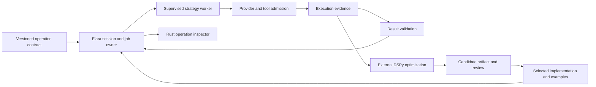

# DSPy ideas for Elara

Research date: **2026-09-06**. This extends the [harness source investigation](harness-ideas-beam-2026-09-06.md) and the [RLM/GEPA paper review](arxiv-rlm-gepa-elara-2026-09-06.md). It proposes experiments, not roadmap changes or a DSPy dependency.

**DSPy's strongest contribution to Elara is a way to define model-backed operations whose public contract stays stable while their instructions, examples, and implementation can improve.** Elara could give those operations durable identities, supervised execution, explicit effect boundaries, and a useful Rust inspector. That is a more specific experiment than adding another general agent loop.

The important shift from the earlier research is to make one small operation the unit of comparison. A check-diagnosis operation could run directly, use curated examples, or perform programmatic evidence analysis. Its caller would still receive the same result shape and source references. The BEAM hypothesis concerns managing these executions and revisions clearly; this research does not establish a quality or performance advantage for Elixir.

## What was inspected

The official repository was shallow-cloned to `/tmp/elara-dspy-research-2026-09-06/dspy`. Source and selected tests were read at **[`f70d08a5b934400d236078143e3704934f2d5dd1`](https://github.com/stanfordnlp/dspy/tree/f70d08a5b934400d236078143e3704934f2d5dd1)**, committed September 5, 2026. The latest published release at review time was **3.3.1, August 21**. The checkout still declares 3.3.1 but contains later changes, including Flex's custom code-proposal hook. HEAD observations below are not automatically claims about that release. [Release](https://github.com/stanfordnlp/dspy/releases/tag/3.3.1), [package/dependency declarations](https://github.com/stanfordnlp/dspy/blob/f70d08a5b934400d236078143e3704934f2d5dd1/pyproject.toml#L5-L38)

The investigation used official documentation, the original DSPy paper, and actual implementation paths. Code graph and CodeScent tools were unavailable; AST-based discovery and bounded reads were used. Elara mappings use the existing source inventory plus direct inspection of its provider, tool, and prompt contracts. Existing local plugin changes were excluded from this research work. No downloaded programs, dependencies, model experiments, or test suites were run.

| Detailed review | Coverage |
| --- | --- |
| [Runtime source review](dspy-runtime-source-review.md) | RLM, ReAct variants, interpreter lifecycle, concurrency, cancellation, streaming, and BEAM/Rust adaptations |
| [Optimization source review](dspy-optimization-source-review.md) | Trace bootstrapping, optimizer choices, DSPy's GEPA adapter, experimental Flex, and candidate artifacts |

The original **DSPy: Compiling Declarative Language Model Calls into Self-Improving Pipelines** paper, Omar Khattab et al., arXiv:2310.03714v1, October 5, 2023, establishes the signatures/modules/optimizer decomposition. Its compiler optimizes a program against examples and a metric, including bootstrapped demonstrations and optional fine-tuning. The experiments concern math and retrieval/QA pipelines with older models. They motivate the abstraction; their numerical gains are not predictions for current coding harnesses. Current typed APIs, RLM, and Flex must be assessed from newer source. [Paper, §§3–7](https://arxiv.org/html/2310.03714v1)

## Lessons from the current source

### 1. Separate task contract, execution strategy, and learned parameters

A DSPy Signature carries inputs, outputs, and instructions. Signature transformations return new classes; instructions and fields can be varied without rewriting each caller. `Predict` resolves its model, examples, configuration, and signature at invocation, then delegates formatting/parsing to an adapter. [Signature transformations](https://github.com/stanfordnlp/dspy/blob/f70d08a5b934400d236078143e3704934f2d5dd1/dspy/signatures/signature.py#L278-L359), [Predict invocation](https://github.com/stanfordnlp/dspy/blob/f70d08a5b934400d236078143e3704934f2d5dd1/dspy/predict/predict.py#L142-L276)

Module composition uses ordinary Python control flow. The module wrapper adds callback ancestry and usage tracking. Optimizer-visible parameters are discovered through module attributes and supported containers; already-compiled child modules are skipped. This is a parameter hierarchy, not a declaration that every function is an independent agent or process. [Module wrapper](https://github.com/stanfordnlp/dspy/blob/f70d08a5b934400d236078143e3704934f2d5dd1/dspy/primitives/module.py#L69-L129), [Parameter discovery](https://github.com/stanfordnlp/dspy/blob/f70d08a5b934400d236078143e3704934f2d5dd1/dspy/primitives/base_module.py#L23-L67)

**Elara adaptation:** give one model-backed operation a named, versioned input/output contract. Keep the implementation choice and learned text/examples as separate values. A pure transformation needs no GenServer; processes belong around useful lifetimes such as a running analysis, an interpreter, or an optimization job. Elara already represents tool implementations as MFA data, which is a useful precedent. [Tool values](../../lib/elara/tool.ex)

### 2. Structured output needs a host acceptance step

DSPy's adapters parse declared output annotations and supply declared defaults for missing optional fields. Missing required outputs raise parsing errors. `Predict` input type mismatches and missing inputs can instead produce warnings; a Signature should not be described as a uniformly strict input gate. Output parsing validates shapes and types, not the truth of generated claims. [Input handling](https://github.com/stanfordnlp/dspy/blob/f70d08a5b934400d236078143e3704934f2d5dd1/dspy/predict/predict.py#L186-L232), [Defaults and parsing](https://github.com/stanfordnlp/dspy/blob/f70d08a5b934400d236078143e3704934f2d5dd1/dspy/adapters/utils.py#L23-L55), [Annotation parsing](https://github.com/stanfordnlp/dspy/blob/f70d08a5b934400d236078143e3704934f2d5dd1/dspy/adapters/utils.py#L187-L237), [Required-output test](https://github.com/stanfordnlp/dspy/blob/f70d08a5b934400d236078143e3704934f2d5dd1/tests/adapters/test_chat_adapter.py#L2879-L2911)

**Elara adaptation:** an analysis result is initially a proposal. Validate required fields, referenced artifacts, source revision, and allowed next operations before accepting it. Missing evidence must remain visible; a default empty list must not accidentally mean that verification succeeded. Preserve the raw response and validation outcome so a repair request or owner inspection can explain the rejection.

### 3. One logical operation may make several provider requests

ChatAdapter can retry through JSONAdapter after non-LM exceptions; `LMError` propagates. JSONAdapter likewise distinguishes provider errors from setup/parsing failures that can trigger a JSON-mode fallback. These are useful compatibility mechanisms, but the number of module calls is not the number of inference requests. [Chat fallback](https://github.com/stanfordnlp/dspy/blob/f70d08a5b934400d236078143e3704934f2d5dd1/dspy/adapters/chat_adapter.py#L69-L115), [JSON fallback](https://github.com/stanfordnlp/dspy/blob/f70d08a5b934400d236078143e3704934f2d5dd1/dspy/adapters/json_adapter.py#L55-L120), [Provider-error regression test](https://github.com/stanfordnlp/dspy/blob/f70d08a5b934400d236078143e3704934f2d5dd1/tests/adapters/test_json_adapter.py#L1323-L1339)

**Elara adaptation:** record the operation, each actual attempt, selected adapter, failure class, and accepted result separately. Admission should apply before every actual request, including repair and fallback attempts. After a parsing failure, a narrowly scoped result-repair request may be appropriate; rerunning an entire operation that performed side effects is a different decision.

Elara already has a provider-neutral request/error boundary and a distinction between streamed public content and the canonical assistant result. Build the operation above that boundary instead of replacing it with provider-shaped dictionaries. DSPy's typed LM path is a useful comparison, but remains a staged compatibility transition: explicit `LMRequest` and experimental calls can produce typed returns while legacy calls retain their shape. [Elara provider](../../lib/elara/provider.ex), [DSPy typed/legacy dispatch](https://github.com/stanfordnlp/dspy/blob/f70d08a5b934400d236078143e3704934f2d5dd1/dspy/clients/base_lm.py#L322-L430)

### 4. Capture configuration with the invocation

DSPy uses process-wide defaults plus `ContextVar` overrides. Global reconfiguration has thread/async-owner checks; a context block merges current defaults with overrides and restores its predecessor on exit. This provides scoped configuration in Python today. It does not constitute a durable configuration record for an interrupted job. [Settings ownership and context](https://github.com/stanfordnlp/dspy/blob/f70d08a5b934400d236078143e3704934f2d5dd1/dspy/dsp/utils/settings.py#L117-L257)

**Elara adaptation:** capture model/effort, instruction scope, operation revision, tool generation, source revision, and allowance in immutable invocation data. Pass that data to supervised tasks explicitly. The session can accept new settings for future requests while preserving what an in-flight attempt actually used. Shared mutable defaults or process-dictionary inheritance would make that explanation harder.

### 5. Learned program state is a deployment artifact, not a running job

DSPy's state-only save serializes named parameters; whole-program save uses cloudpickle. Dependency mismatches warn on loading. General state loading first tries a copy, which catches ordinary failures before mutating the target. That mechanism is not a crash-consistent transaction across files, tools, or arbitrary custom loaders. Module serialization deliberately excludes history and callbacks. [State/save/load paths](https://github.com/stanfordnlp/dspy/blob/f70d08a5b934400d236078143e3704934f2d5dd1/dspy/primitives/base_module.py#L156-L292), [Module serialization](https://github.com/stanfordnlp/dspy/blob/f70d08a5b934400d236078143e3704934f2d5dd1/dspy/primitives/module.py#L80-L91)

One concrete documentation/source discrepancy matters: the deeper Signature guide describes serialization of annotations and field tags, but the inspected `dump_state` stores instructions and an ordered list of prefix/description metadata. Loading applies those entries to an already-constructed signature by position. Treat the implementation as evidence; this state is not a complete portable schema. [Actual serialization](https://github.com/stanfordnlp/dspy/blob/f70d08a5b934400d236078143e3704934f2d5dd1/dspy/signatures/signature.py#L524-L545), [Corresponding test](https://github.com/stanfordnlp/dspy/blob/f70d08a5b934400d236078143e3704934f2d5dd1/tests/signatures/test_signature.py#L241-L279), [Guide](https://github.com/stanfordnlp/dspy/blob/f70d08a5b934400d236078143e3704934f2d5dd1/docs/docs/diving-deeper/signatures-in-depth.md)

**Elara adaptation:** a candidate manifest should identify the full contract hash, implementation and adapter revisions, learned instructions/examples, compatible models/tools, and the evidence used to select it. Store its activation separately from running-job state. A job checkpoint instead contains accepted outputs, pending attempts, artifact references, and unresolved effects. Loading a selected program does not resume those effects.

Flex adds another distinction: JSON state can contain program source for later execution, even though its initial bind only parses the code. Classify an artifact by what running it can do, not its filename extension. See the [Flex review](dspy-optimization-source-review.md).

### 6. Cache identities and sampling identities are different

DSPy's request cache hashes request arguments and function identity, with default exclusions including credentials and endpoint keys. Hits copy responses, mark cache use, and clear billable usage data. Its wrapper checks the cache, computes, then stores; it does not coalesce concurrent misses into one in-flight request. `rollout_id` changes the cache identity without being sent to the provider. [Cache implementation](https://github.com/stanfordnlp/dspy/blob/f70d08a5b934400d236078143e3704934f2d5dd1/dspy/clients/cache.py#L100-L187), [Request wrapper](https://github.com/stanfordnlp/dspy/blob/f70d08a5b934400d236078143e3704934f2d5dd1/dspy/clients/cache.py#L219-L313), [Rollout-ID test](https://github.com/stanfordnlp/dspy/blob/f70d08a5b934400d236078143e3704934f2d5dd1/tests/clients/test_lm.py#L134-L178)

**Elara adaptation:** keep four concepts distinct: reusing a deterministic evidence transformation, reusing a prior model response, requesting a fresh sample, and replaying a recorded transition. Give model-response caches an explicit provider/endpoint scope as well as model and request identity. A fresh sample bypasses response reuse but cannot promise a different or deterministic answer.

A workspace service could coalesce identical pure reads or analysis requests, retaining separate subscribers so one cancellation does not cancel another owner's work. Do not apply that rule to an entire mutating workflow. Report cached work, original provenance, and newly incurred inference separately in the inspector. This extends the earlier shared-evidence proposal; it is not a cache currently verified in Elara.

## What RLM, GEPA, and Flex add to this picture

The companion reviews examine the distinctions in detail. These are the resulting **Elara design choices**:

| DSPy mechanism | Useful Elara experiment | Boundary to retain |
| --- | --- | --- |
| Trace bootstrapping | Curate a few input/output examples for one evidence-analysis operation. | Final-run success gives candidate evidence, not proof that every intermediate step was correct. |
| Instruction/example optimization | Compare versions of a small operation against understandable outcomes. | Keep independent task feedback outside repeated candidate selection. |
| RLM and interpreter integration | Use an external DSPy worker as a reference implementation for programmatic context analysis. | Bind actual model requests and host tools to Elara's job identity and allowance. |
| Experimental Flex | Search over one bounded operation's implementation behind a fixed contract. | Candidate code owns an explicit execution scope; it cannot rewrite its acceptance conditions. |
| Hierarchical callbacks | Display operation, interpreter, tool, and provider ancestry in Rust. | Progress and callback records do not replace authoritative completion/effect facts. |
| Parallel evaluation | Schedule independent candidate/example work under a shared allowance. | Concurrency limits and total inference budgets are separate controls. |

The [runtime review](dspy-runtime-source-review.md) explains why DSPy's RLM is not identical to the previously inspected author implementation, and records existing concurrency support and its boundaries. The [optimizer review](dspy-optimization-source-review.md) explains why the pinned GEPA dependency cannot be treated as current standalone GEPA HEAD. These differences matter when choosing an actual prototype.

## Three experiments worth doing

These are our proposals. They introduce no new roadmap status and do not start the deferred broad benchmark program.

### A. One contract, several implementations

Start with a read-only operation that diagnoses a focused check from its output and changed-file evidence. Its conceptual contract could be:

```text
check_evidence, changed_file_refs -> findings, supporting_refs, unknowns
```

Keep required output fields and evidence identity fixed. Compare a direct request with the same request plus a few curated examples. Add an RLM-backed implementation only for evidence too large or distributed for those simpler variants. Do not create a general workflow language first.

Elixir should own the invocation and validate the result. A supervised worker performs the chosen strategy; a provider broker records each actual request. The Rust view shows the operation revision, inputs by reference, attempt tree, and accepted structured output. This is a small addition above the existing [provider contract](../../lib/elara/provider.ex) and [session owner](../../lib/elara/session.ex), not a replacement of the agent Core.

**Acceptance:** missing evidence produces an explicit rejection; an optional explanatory field may be absent without turning failure into success. Switch strategy with the same contract, cancel during a pending request, and supply a late result from the previous attempt. The owner can explain which result was accepted and why. Scripted responses test these contracts; representative task feedback tests whether a strategy helps.

### B. A versioned example artifact with a small promotion step

From completed runs of that operation, propose a few demonstrations. Each example records the input/output, source revision, final outcome, known limitations, and selection reason. Curate them before use. Keep failed or misleading examples available as diagnostic evidence rather than adding them to the positive demonstrations.

The first artifact can be manually selected. Later, DSPy can optimize the examples or instructions in an external Python process and return a candidate manifest. Elara records parent/candidate identity, validates the contract, and activates the chosen revision between requests. Previously started work continues with its captured revision.

**Acceptance:** reject an artifact with a mismatched output schema, preserve the active version after a failed load, and compare the candidate on tasks that did not choose its examples. A restart retains the selected artifact and completed evidence; unresolved provider attempts remain explicit. This connects DSPy's compilation model to Elara's persistent runtime without confusing compilation with recovery.

### C. A bounded Flex-like implementation slot

After the operation is useful, permit one alternative implementation to change its internal decomposition: extract candidate failures, look up a bounded set of relevant source spans, and combine findings. The optimizer could discover whether a deterministic transformation, one LM call, or several independent calls works best. The public contract remains fixed.

Prototype this outside Elara's authority VM, using DSPy's experimental Flex as a research comparison if its interpreter capabilities fit. Keep the host operation vocabulary small and broker every model/tool request. Elara's current Rust command boundary is useful process-control machinery; it does not automatically provide DSPy's sandbox or a durable program runtime. [Execution boundary](../../lib/elara/exec.ex)

**Acceptance:** candidate code cannot enlarge its allowance, emit an accepted result with fabricated evidence IDs, or promote itself. Interrupt the worker and retain its completed artifacts. Compare code and output differences in Rust before explicit promotion. This would explore live evolution at one understandable boundary, building on the current [plugin lifecycle](../../lib/elara/plugin/server.ex).

Do not map every generated candidate to a new module loaded into the long-lived BEAM. An external worker or replaceable runtime avoids assuming that hot code loading supplies automatic resource retirement, state migration, or effect rollback. Those remain separate experiments.

## Suggested architecture relationship

This is a possible target, not an implementation delivered by this research.

The BEAM-specific experiment is to turn a changing program into a set of inspectable lifetimes. A useful prototype could map the responsibilities as follows:

| Responsibility | Concrete BEAM design to try | What Elara must still supply |
| --- | --- | --- |
| Operation contract and selected revision | Immutable structs, a small behaviour, and pure acceptance functions. | Schema compatibility and evidence validation; a behaviour alone does not validate runtime values. |
| Running candidate or interpreter | An owner under `DynamicSupervisor`, with `Task.Supervisor.async_nolink` for fallible leaf work. | Persisted invocation/attempt IDs, explicit recovery rules, and handling of task results and `:DOWN` messages. |
| Candidate/example scheduling | One coordinator serializes admission decisions, then permits independent tasks to run concurrently. | A queue bound and a durable allowance that also covers nested requests. |
| Shared artifact and revision lookup | An owner-managed ETS table indexes immutable artifact IDs and currently selected revisions. | Durable storage, invalidation, and subscriptions; ETS ownership is not persistence. |
| Live strategy replacement | Publish a new artifact revision for future invocations while existing owners retain their captured revision. | Compatibility checks and explicit retirement of old workers/artifacts. |
| Rust inspection | Send projections of authoritative owner events, including parent/child attempt identities. | Bounded delivery, reconnect snapshots, and reliable final outcomes. |

The process and table semantics come from OTP; the operation protocol above is our proposal. In particular, `async_nolink` tasks are temporary and report results/failures to the caller, while ETS tables have an owner and normally disappear when that owner terminates. [Task supervision](https://elixir.hexdocs.pm/Task.Supervisor.html#async_nolink/3), [Dynamic supervision](https://elixir.hexdocs.pm/DynamicSupervisor.html), [ETS ownership](https://www.erlang.org/doc/apps/stdlib/ets.html)



Keep pure steps as functions and authoritative state as data. Use BEAM processes for independent lifetimes, failure observation, admission, and subscriptions. The experiment is whether Elara can make a changing model-backed program understandable over time, including partial failure and replacement.

## Recommendation

Start with **one typed evidence-analysis operation and a versioned example artifact**. This adds a useful intermediate step before the earlier RLM experiment: define what a successful result must contain, then compare strategies behind that boundary. DSPy is valuable both as a source of design ideas and as an external reference implementation; porting the entire framework would obscure what Elara is trying to learn.

Flex is the most ambitious follow-on because it connects program optimization to Elara's live-capability interests. The lasting contribution would be an observable lifecycle for proposed behavior, selected behavior, and running work, with evidence showing whether each change helps.
