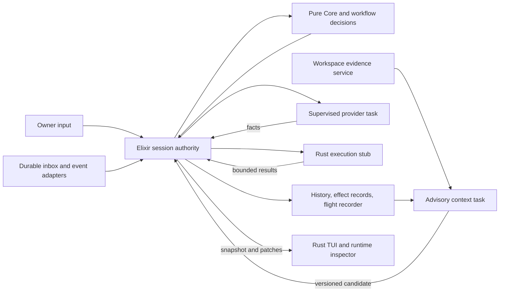

# Harness ideas for Elara: an experimental BEAM runtime

Research date: 2026-09-06. This is a source investigation and experiment proposal, not an implementation plan or a second roadmap.

The [arXiv, RLM, and GEPA companion report](arxiv-rlm-gepa-elara-2026-09-06.md) extends this investigation with paper evidence and further BEAM experiments.

Elara's strongest direction is a runtime in which agents, context preparation, verification, and capabilities have explicit lifetimes and observable state. Its current Elixir authority and Rust edges are a good foundation for that experiment. The next useful work should make those runtime properties do something visible for the agent or owner.

None of these mechanisms requires BEAM. The hypothesis is that its process, supervision, messaging, code-loading, and inspection primitives let Elara express their lifecycles with less custom machinery. That is an engineering advantage to investigate, not an assumption that adding processes improves model reasoning or reduces inference cost.

The owner's current objective is exploration of Elixir/BEAM harness engineering. Daily-driver parity is not the ranking criterion here. Existing roadmap statuses and the separately deferred evaluation/benchmark program remain unchanged; the scenarios below are small acceptance exercises, not requests to start a benchmark project.

## Evidence and scope

All four GitHub repositories were shallow-cloned and their actual source and selected tests inspected. Both Stencil articles were read in full. Reviews distinguish implementation, documentation, experimental/default-off behavior, and our own proposals. Dependencies were not installed, downloaded programs were not executed, and no fresh product/test-suite acceptance is claimed.

| Source | Inspected revision | Detailed source review |
| --- | --- | --- |
| oh-my-pi | [`6d3bc569d16cd7351073eaa767caed51021befbb`](https://github.com/can1357/oh-my-pi/tree/6d3bc569d16cd7351073eaa767caed51021befbb) | [oh-my-pi mechanisms and caveats](oh-my-pi-source-review.md) |
| Empryo repository | [`92320fb6eeb6b81ee8c69d9fc73e09e032b5b1a0`](https://github.com/proxysoul/Empryo/tree/92320fb6eeb6b81ee8c69d9fc73e09e032b5b1a0) | [Archived SoulForge source review](empryo-source-review.md) |
| Grok Build | [`72a61251fcffb464bcc687aeb5a998e5a98ec0c9`](https://github.com/xai-org/grok-build/tree/72a61251fcffb464bcc687aeb5a998e5a98ec0c9) | [Grok Build and Deepagents review](grok-build-deepagents-source-review.md) |
| Deepagents | [`07d2952d346d81d06bd181db8c560a77f2b51bc8`](https://github.com/langchain-ai/deepagents/tree/07d2952d346d81d06bd181db8c560a77f2b51bc8) | [Grok Build and Deepagents review](grok-build-deepagents-source-review.md) |

The clones are retained under `/tmp/elara-harness-research-2026-09-06/`, with one directory per repository and downloaded article text under `blogs/`. This is temporary local storage; the durable findings are these Markdown files and their pinned upstream links.

Elara was inspected at base commit `63d86102623836be3444079f594d6322b99659cf` **plus existing uncommitted changes**, notably PLUGIN-1. Local source links therefore describe the inspected working copy, not necessarily that commit alone. The code graph and CodeScent tools were unavailable in the session; AST-based discovery and bounded source reads were used instead. Existing research, README, the roadmap queue, and source were compared rather than treating older design prose as a current inventory.

The Empryo repository explicitly retains archived **SoulForge** source. Its newer Empryo product descriptions are not evidence that the current desktop product uses each inspected mechanism. The archived package declares BUSL-1.1; this report harvests design ideas and does not copy implementation code. Grok Build, in contrast, publishes substantial Rust runtime code as well as its TUI. See the source reviews for provenance and limits.

## What Elara already has

| Area | Source-backed capability | Boundary relevant to this research |
| --- | --- | --- |
| Session runtime | `Session.Core.step/2` is a pure state/effect reducer; a `Session` GenServer owns tasks, timers, subscriptions, and persistence. [Core](../../lib/elara/session/core.ex), [shell](../../lib/elara/session.ex) | Tools within one provider batch currently run sequentially. Concurrency comes from separate sessions/tasks; a BEAM scheduler does not parallelize that reducer protocol. |
| Supervision | Registries, dynamic supervisors, unlinked supervised provider/tool tasks, and monitored owners. [Application](../../lib/elara/application.ex), [Session](../../lib/elara/session.ex) | Session children use `restart: :temporary`. Persistence and explicit recovery exist; automatic resurrection of arbitrary work is not the current contract. |
| History and effects | Conversation trees, clone/fork/resume, durable input state, controller intent, executor ledger, and receipt-backed local declarative `write`. [Store](../../lib/elara/session/store.ex), [effect modules](../../lib/elara/effect/) | Receipt-backed effects remain scoped to `write`. `edit`, shell commands, plugins, and remote execution do not inherit an exactly-once guarantee. |
| Replay and causality | Versioned facts, effect/state comparisons, causal explanation through `why`, alternative reducer functions, and injected transitions. [Flight recorder](../../lib/elara/flight_recorder.ex) | Replays recorded Core facts without running providers/tools. It excludes provider-private continuation and does not reconstruct every shell/plugin/workspace state. |
| Provider/input surface | Streaming answers and public reasoning parts, persisted model/effort controls, usage reporting, file references and image attachments. [Provider](../../lib/elara/provider.ex), [visibility](../../lib/elara/provider/visibility.ex), [attachments](../../lib/elara/attachment.ex) | Settings can apply at the next request, including within a tool loop; this is already an entry point for model-selection experiments. Provider-internal reasoning is not portable public context. |
| Instructions and skills | Scoped project instructions, deferred tool execution when newly applicable instructions were not presented, skill metadata discovery and selective body loading. [Prompt](../../lib/elara/prompt.ex), [Skills](../../lib/elara/skills.ex) | Selective bodies already exist. The metadata catalog still contributes to every request's system context; loading a skill does not grant tools or capabilities. |
| Threads and workspaces | Persistent research/coding children, parent/child navigation, worktrees, explicit patch integration and cleanup. [Threads](../../lib/elara/threads.ex) | Coding children start from committed HEAD; they do not inherit dirty parent files. Worktrees are not hostile-code isolation. Child plugins are disabled. |
| Communication | Durable identities/receipts, paged evidence reads, queued completion reports, interruptible event waits, wake budgets, and stop/pause preservation. [Communication](../../lib/elara/threads/communication.ex) | Event-driven waiting is already implemented. The extension opportunity is additional useful event sources and durable workflow state, not another polling loop. |
| Context continuity | Conservative request accounting and staged automatic handoff to a linked fresh session. The extractive evidence index points back to original messages. [Context](../../lib/elara/session/context.ex), [Handoff](../../lib/elara/session/handoff.ex) | This is linked continuation, not speculative background summarization or a general request-context compiler. Accounting is deliberately conservative, not exact tokenization. |
| Live plugins | Separate plugin processes, generation references, exclusive invocation leases, staged reload and migration. Current PLUGIN-1 changes add discovery and explicit TUI reload. [Plugin server](../../lib/elara/plugin/server.ex), [reload path](../../lib/elara/session.ex), [plugin guide](../plugins.md) | Working-copy PLUGIN-1 is in progress. State is live-session state; activation is owner-triggered between turns. Multi-plugin commit is sequential, old generated modules lack retirement, and plugin tools bypass the ordinary capability branch. |
| Rust edges | TUI snapshot/patch projection with gap/incarnation recovery, editor/transcript/tool views, layouts/themes, and a separate command stub behind an Erlang Port. [TUI](../../native/elara-tui/src/lib.rs), [Exec](../../lib/elara/exec.ex), [stub](../../native/exec-stub/src/main.rs) | Rust already has a useful responsibility boundary. Per-command output/timeout/process-group cleanup exists; that does not bound every mailbox, file read, artifact, or subscriber queue. |
| Placement | Health/load/affinity/capability/workspace-aware local and remote executor routing. [Router](../../lib/elara/executor/router.ex) | Remote routing is an explicit protocol, not a distributed-Erlang cluster. Mutating transport failures remain indeterminate. |

Selected test bodies corroborate these intended contracts: [next-request settings](../../test/elara/session/core_test.exs), [effect-free replay and injection](../../test/elara/flight_recorder_test.exs), [event waits and wake budgets](../../test/elara/thread_communication_test.exs), and [handoff provenance/recovery](../../test/elara/context_test.exs). These tests were inspected, not rerun during this research.

Two distinctions matter when extending this architecture:

- **Single authority does not mean complete operational replay.** Elara has several scoped records: transcript/inbox storage, thread metadata, effect records, and Core recordings. New workflow state needs an explicit durable owner; placing it in another GenServer's memory would not make it rewindable or resumable.
- **Supervised does not mean bounded.** `Session.emit/4` sends to subscribers, and `FlightRecorder.complete_transition/4` synchronously syncs persistent recordings. These are concrete places to examine when increasing concurrency. They are not demonstrated bottlenecks in this review, and deleting durability to chase throughput would change the contract.

## What to harvest from the six sources

| Source | Most useful contribution | How it changes the Elara question |
| --- | --- | --- |
| oh-my-pi | Explicit child lifecycle, bounded scheduling, prewalk, context maintenance, and deeper edit/tool contracts | How can Elara carry useful task state across model changes and idle periods while keeping effects and context provenance clear? [Source review](oh-my-pi-source-review.md) |
| SoulForge archive | Cache-stable context prefixes, bounded file deltas, structured working memory, shared reads and agent coordination | Can one supervised workspace service save repeated discovery and produce fresher, smaller model requests? [Source review](empryo-source-review.md) |
| Grok Build | Speculative two-pass compaction with validity checks; careful child-worktree preservation; explicit runtime policy machinery | Can advisory processes prepare work concurrently and let the session accept only a compatible result? [Source review](grok-build-deepagents-source-review.md) |
| Deepagents | Normal summarization separates retained history from request projection; overflow recovery can rewrite tail state. Also useful: structured output offload, backend boundaries, deterministic hook-result reduction. | Can Elara retain evidence while tailoring context and composing policy without hidden mutable middleware state? [Source review](grok-build-deepagents-source-review.md) |

The **Harness Playbook** proposes journal-derived session state, host-owned policy, bounded execution, declarative settings, and Directors that arbitrate yielding. It connects provider compatibility, deeper tools, speculative compaction, and typed views to those constraints. Its omp² sections mix implementation and design work; they are not all shipped features. Elara has already adopted much of the authority/Rust-edge foundation, as its [split decision](../rust-elixir-split.md) records. The most useful remaining ideas concern workflow ownership and context scheduling. [The Harness Playbook](https://stencil.so/blog/harness-playbook)

**Prewalk** proposes transferring the existing trajectory after the guide has made an initial edit, with a task checklist, instead of handing over only a prose plan. The post reports results from its own SWE-bench experiments; those are not reproduced here and do not predict Elara's quality, cost, or latency. In omp's implementation the handoff occurs after persisted tool results and uses a temporary model change. Its action predicate recognizes selected edit/write actions without checking `isError`; successful mutation is a stronger contract than this implementation establishes. It does not provide filesystem rollback, and provider adaptation can change the transferred representation. [Prewalk article](https://stencil.so/blog/prewalk), [coordinator](https://github.com/can1357/oh-my-pi/blob/6d3bc569d16cd7351073eaa767caed51021befbb/packages/coding-agent/src/session/prewalk.ts#L141-L213), [action predicate](https://github.com/can1357/oh-my-pi/blob/6d3bc569d16cd7351073eaa767caed51021befbb/packages/coding-agent/src/session/prewalk.ts#L28-L54)

## Ranked experiments

These are our proposed Elara designs, inferred from the inspected mechanisms and current code. The ranking weighs BEAM learning, visible usefulness, and scope. It is not a commitment to implement every row.

| Priority | Experiment | BEAM relevance | First useful slice |
| --- | --- | --- | --- |
| 1 | Background context preparation with provenance | High: supervised advisory work, isolated failures, explicit acceptance at one owner | Prepare a deterministic continuation/evidence view from a fixed history prefix while the current turn runs. |
| 2 | Agents that wake on useful events | High: monitored subscriptions and many inactive process lifetimes | A focused test-completion event reaches the existing durable inbox once, honoring stop/pause. |
| 3 | Runtime inspector with causal replay | High: process introspection and scoped tracing joined to existing recordings | Show why a session is waiting, its active tasks, and the causal event behind one result. |
| 4 | Durable workflow state and completion decisions | High: explicit event transitions, supervision of the work they request | A bounded test/fix/verify workflow survives interruption with its phase and attempts intact. |
| 5 | Same-trajectory model handoff | Medium: serialized boundaries help, but the mechanism is portable | Switch model settings after one chosen successful mutation and preserve a small task checklist. |
| 6 | Shared workspace evidence and context deltas | Medium-high: one monitored owner plus read caches shared by many sessions | Deduplicate identical reads at the same workspace revision; invalidate on change. |
| 7 | Capabilities that evolve during a session | High, but overlaps current work and needs explicit authority | Build on PLUGIN-1 with one versioned capability and bounded revision lifetime. |

### 1. Background context preparation

Elara currently computes a deterministic handoff index when continuation is needed. Start by moving **preparation** of a bounded, immutable evidence view into an advisory supervised task. Keep the existing handoff stages as the only way to transfer delivery ownership. Do not create or activate a successor speculatively.

A mere asynchronous wrapper around today's index would not establish a useful improvement. The candidate should add a concrete context benefit, such as preparing requested source excerpts alongside exact verification references. The initial BEAM learning objective is reliable advisory-work lifetime and acceptance, not a demonstrated speedup. If constructing that view is trivial and does not interrupt work, retain it as a pure projection and defer the worker. Concurrency is a means to a visible result, not the acceptance criterion.

Tag a candidate with the source session/branch, covered message IDs or prefix digest, context-policy version, instruction/tool catalog fingerprint, and applicable provider settings. On completion, the session checks whether that covered prefix still matches. Appended messages can remain an uncovered tail; a branch switch or changed instruction interpretation invalidates the candidate. Requiring the entire live head to stay unchanged would make background work useless during active turns.

Do not run today's `Handoff.summary/2` unchanged against a captured shell and treat its output as current. It also reads previous source stores, the inbox, and live child records. Prepare only transcript-derived evidence from identified source entries; validate source lineage, recompute recent-owner/tool windows with the tail, and refresh inbox/child facts under session ownership at the handoff boundary. A cached candidate never determines delivery ownership. [Current summary inputs](../../lib/elara/session/handoff.ex)

This combines Grok's stale-result rejection and Deepagents' normal request projection with Elara's evidence-preserving handoff. Deepagents' overflow fallback can also rewrite tail state; absolute transcript immutability is our proposed constraint, not a claim about all of its paths. The first version can remain extractive and make no additional model requests. Later, a separately budgeted summarizer could propose semantic summaries, retaining exact evidence references. [Grok prefix validation and live tail](https://github.com/xai-org/grok-build/blob/72a61251fcffb464bcc687aeb5a998e5a98ec0c9/crates/codegen/xai-grok-shell/src/session/compaction.rs#L242-L401), [Deepagents projection](https://github.com/langchain-ai/deepagents/blob/07d2952d346d81d06bd181db8c560a77f2b51bc8/libs/deepagents/deepagents/middleware/summarization.py#L767-L848), [overflow path](https://github.com/langchain-ai/deepagents/blob/07d2952d346d81d06bd181db8c560a77f2b51bc8/libs/deepagents/deepagents/middleware/summarization.py#L1345-L1484). Elara entry points are `Context.budget/2`, `Handoff.summary/2`, and the shell's provider-dispatch boundary.

**Acceptance:** delay preparation, append a tool result and an owner correction, then request continuation. The original prefix and live tail remain accessible, the correction wins, and stale results after fork/stop are ignored. Kill the preparation task: the session continues using its existing handoff path. Candidate failure cannot become loss of canonical history.

**BEAM question:** can independently supervised context work remove an interruption from the agent's active path without creating another state authority? `Task.Supervisor.async_nolink` already fits the shell's task model; a task supplies a result and failure notification, not durable execution. [Task.Supervisor documentation](https://elixir.hexdocs.pm/Task.Supervisor.html)

### 2. Event-driven agents with explicit wake conditions

Elara already has `thread_wait`, completion reports, paused inputs, stable message IDs, and a durable wake budget. Extend that mechanism to one concrete event: completion of a focused test job associated with a workspace revision. An agent can wait for that fact while other sessions remain active.

A small supervised adapter converts an execution result into a typed event containing job identity, workspace/revision, outcome, and an evidence reference. Persist acceptance before model delivery using the existing inbox contract. For an offline recipient, preserve the event and require the existing explicit-open/resume behavior initially. Automatic process resurrection would be a separate design choice.

**Acceptance:** the same completion is delivered twice, the receiver is stopped while the job finishes, and the adapter restarts. One logical inbox input is accepted, stop remains effective, no new model request occurs while paused, and reopening never reruns the test command. An obsolete workspace revision is visibly stale evidence.

This makes process lifetime useful independently of inference lifetime. It is also a better first experiment than adding cron-shaped self-prompts or an unconstrained autonomous goal loop. omp's idle/park/revive machinery and SoulForge's event bus provide useful lifecycle comparisons, but Elara's existing [communication layer](../../lib/elara/threads/communication.ex) should remain the delivery foundation.

### 3. Make runtime behavior inspectable in the Rust TUI

Add a focused inspector to Observatory: session identity and phase, current provider/tool task, wait target, pending inbox inputs, plugin generation, context candidate status, and the last relevant causal transition. Much of the raw data already exists in the shell and flight recorder; Rust should render a versioned projection of it.

Start with one practical interaction: select a result and ask why it happened, or select a waiting thread and see what can wake it. An on-demand replay can show the first divergent state/effect under an explicitly selected alternate reducer. Keep replay advisory and effect-free, as it is today.

Add sampled mailbox length, memory, and reductions only when useful. OTP supports independent trace sessions and cleanup, including system-event monitoring. Use a bounded, session-scoped collector and avoid payload logging by default; an inspector that floods the session would defeat its purpose. [OTP trace sessions](https://www.erlang.org/doc/apps/kernel/trace.html), [Elara recorder](../../lib/elara/flight_recorder.ex), [TUI projection](../../native/elara-tui/src/lib.rs)

**Acceptance:** a child waits, a tool crashes, and the TUI disconnects/reconnects. The inspector explains the waiting/failure state from current authority and shows the same causal result after attachment. Replaying the recording runs neither the tool nor the provider. A slow inspector is dropped/resnapshotted under a declared limit while the session remains usable.

This would make BEAM behavior part of the experiment's visible output. It would also expose whether more actors are clarifying ownership or merely increasing coordination.

### 4. Durable workflow state and explicit completion

`Core.finish_provider/3` currently ends a turn when the assistant has no tool calls. Introduce one narrowly scoped policy: a selected test/fix/verify workflow can accept completion, request a verification step, or wait for evidence, within a finite attempt budget. Persist its phase, selected target, evidence IDs, and remaining attempts so it cannot disappear in a closure or plugin restart.

Keep the decision in a pure transition over data. Supervised tasks perform requested work and return facts. A `:gen_statem` process is an option if named timeouts, state-entry behavior, or postponed events become useful; it is not a reason to rewrite the existing pure Core. OTP explicitly supports both simple GenServer state machines and the more specialized behavior. [gen_statem guide](https://www.erlang.org/doc/system/statem.html)

**Acceptance:** after a failed focused check, the workflow permits one repair and rerun. Interrupt between verification and completion, then resume: the target and remaining budget match the stored state; uncertain mutations are reconciled rather than retried; an owner correction can change or end the workflow. The first version need not support arbitrary nested workflow stacks.

The Playbook's completion arbitration and Deepagents' deterministic hook reduction are useful design inputs. Elara's distinct opportunity is to make the continuation inspectable, persistable, and replayable with the existing fact/effect vocabulary. Generic hook registration alone would not establish that property.

### 5. Prewalk as a controlled model-transition experiment

Elara already applies accepted settings to the next provider request. Build on that with explicit guide/executor phase state and a small persisted checklist. Initially stay within one supported provider route to reduce history-conversion uncertainty.

Trigger at a settled, successful operation from an explicit allowlist, after all tool results in the current batch are recorded. A successful tool return demonstrates execution, not a correct solution. Keep the selected verification obligation visible. Treat failure, cancellation, no-op, and indeterminate outcomes explicitly; do not infer progress from the assistant saying it edited something.

Preserve the canonical trajectory and record the model change. If a guide-only instruction is omitted from the next request, do so in a context projection with provenance, leaving historical evidence intact. The first slice could use receipt-backed `write`; extending the trigger to `edit` should acknowledge its different effect contract.

**Acceptance:** failed and cancelled writes do not switch phase; a confirmed write does; the next request receives the intended model settings and complete tool-call/result pairing. Resume retains the chosen phase. Any later cross-provider extension explicitly handles opaque provider state and incompatible tools. [Existing settings test](../../test/elara/session/core_test.exs), [omp prewalk and translation review](oh-my-pi-source-review.md)

This is a useful harness experiment even though it is not especially BEAM-specific. No performance claim should be imported from the post.

### 6. A shared workspace evidence service

Several children may read the same source and rediscover the same changes. A workspace process can own a bounded cache of content-addressed file slices and in-flight read requests. Key results by workspace identity, content digest, tool/version/arguments, and access scope. Distribute references to larger artifacts instead of copying whole transcripts through every mailbox.

SoulForge's cache-stable prefix and provenance-rich deltas are the useful ideas. Keep a stable per-request context prefix, append explicit file-change facts, and retain retrieval paths to source. The service must not treat mtime alone as proof of unchanged content or reuse a result across different child worktrees. Untrusted file text remains tool evidence. [SoulForge snapshots and deltas](https://github.com/proxysoul/Empryo/blob/92320fb6eeb6b81ee8c69d9fc73e09e032b5b1a0/src/core/context/manager.ts#L1409-L1627), [shared-read generations](https://github.com/proxysoul/Empryo/blob/92320fb6eeb6b81ee8c69d9fc73e09e032b5b1a0/src/core/agents/agent-bus.ts#L129-L357)

ETS is suitable for a reconstructible local index owned by this process; it is not persistent storage. Persist artifacts separately before placing a retrieval reference into authoritative history. [ETS ownership and storage semantics](https://www.erlang.org/doc/apps/stdlib/ets.html), [SoulForge review](empryo-source-review.md)

**Acceptance:** two children request the same version of a file and share one read; a write invalidates it; a late read from the previous generation is rejected; one consumer cancelling does not deprive the other of its result. Enforce result-size and cache limits. This is also a natural place for a small, genuinely independent read batch before attempting general parallel tool execution.

### 7. Evolving capabilities with bounded lifetimes

Current PLUGIN-1 is already a direct experiment in useful live code. Preserve its focused test/fix/rerun scenario. Further research should address durable plugin state, explicit authority, capability catalog versions, and retirement of loaded revisions before generalizing to an agent-generated tool ecosystem.

Bind each invocation to the catalog version the model saw, and let one session owner activate a validated revision at a declared boundary. A rejected candidate leaves the usable generation available; a completed invocation cannot silently commit state to the wrong generation. Owner-triggered reload is not model-driven installation or same-turn capability acquisition.

For frequent generated revisions, a recyclable external BEAM runtime is an interesting later experiment: retain a durable descriptor and migrate explicitly serializable state, then replace the runtime to reclaim all of its resources. That would need its own transport and shutdown semantics. A separate node is not an OS sandbox or an authority boundary by itself. Ordinary BEAM code loading has current/old versions; successful hot replacement does not automatically migrate state or reverse effects. [Code-loading semantics](https://www.erlang.org/doc/system/code_loading.html), [existing capability research](elara-live-capability-runtime.md)

**Acceptance:** run one useful versioned tool, activate an allowed revision, reject a broken revision, restart its owner, and distinguish which state survives. A stale generation cannot execute. Revocation does not claim to undo a command already dispatched.

## How the proposed pieces fit

This is a target relationship diagram, not a proposal to add every process in one change. Existing session/effect/inbox records remain authoritative in their defined domains.

The governing rule is that background processes may propose results, while the session validates whether they still apply. Durable state remains data. Process IDs, monitors, timers, caches, and UI state are replaceable runtime machinery.

## More ambitious research branches

The small slices above establish useful contracts. Three larger experiments would push the runtime further without making daily-driver polish their prerequisite. These are original proposals, not features verified in the external repositories.

**Live shadow policies.** Let a candidate workflow or context policy observe the same recorded facts as the active policy in a separate supervised process, with no ability to execute effects. The inspector compares decisions and explains the first divergence. An explicit promotion could later move authority at a quiescent boundary with a state migration and durable version record. Elara's alternate-step replay makes the read-only stage unusually accessible. This tests whether a running harness can explain and evaluate a proposed change to its own behavior. It does not prove future model quality or make arbitrary core replacement safe.

**A persistent workspace team.** Keep specialists for test failures, dependency knowledge, and change review as durable identities with subscriptions. Most are inactive; they wake only when a relevant revision or result arrives, exchange bounded evidence, and sleep again. Put the provider-request budget above the team, separate from process lifetime. The interesting result would be accumulated, revision-aware understanding with very little idle inference—not an ever-growing group chat. A small first team should explain why each wake happened and suppress duplicate or irrelevant work.

**Replaceable execution and capability runtimes.** Keep the session alive while replacing one helper runtime, migrating one plugin's serializable state, or reconnecting an artifact service. Later, test a disposable BEAM node for generated capability revisions and a Rust executor on another host using the same explicit job contract. The experiment succeeds only when the user can follow one logical task across those replacements and see which operations finished, failed, or remain uncertain. This explores BEAM's lifecycle and code-loading strengths while preserving the host's authority and the separate OS execution boundary.

These directions are more distinctive than increasing the number of simultaneous model calls. Their value would be continuity, explainability, and controlled evolution of the running harness.

## Ideas to defer or adapt carefully

| Idea | Assessment for Elara |
| --- | --- |
| Generic XML/DOM or ECS replacement | Elara already has a useful reducer and projections. Adopt explicit state ownership where a concrete feature needs it; a representation rewrite would obscure whether the new behavior helped. |
| Unlimited parallel tool calls | Current Core is intentionally sequential. Begin with reads whose independence and identity are known; mutating tools, plugin leases, instructions, and cancellation require deliberate ordering. |
| Full-history automatic workspace rewind | Transcript branching, process cancellation, and file restoration are different operations. SoulForge's checkpoint implementation has source-level conflict-handling concerns; Grok's newer durable rewind domains are default-off. Preserve Elara's explicit integration/effect boundaries. |
| Lossy context replacement presented as recoverable | omp has an artifact-save failure path that can still replace content; Deepagents also has fallback paths whose comments/test names require careful reading. In Elara, establish durable artifact success before promising retrieval. |
| Speculative coding swarms | Worth a later trial using two explicit workspace branches and a reviewable integration result. Current child worktrees omit dirty parent state; neither worktrees nor BEAM processes make arbitrary child commands isolated. |
| Cluster-first architecture | Existing remote routing already provides a placement seam. First demonstrate useful concurrent local actors; distributed workspace identity, delivery, fencing, and credentials add separate problems. |
| Automatic core self-patching | Read-only alternate-reducer replay is a smaller experiment. A replay match does not establish safe shell-state migration, future provider behavior, or rollback of external effects. |
| Broad TUI framework or plugin rendering language | Use one inspector within the current Rust views. General layout/component extension protocols should follow a demonstrated presentation need. |

These cautions come from the detailed source reviews and Elara's current contracts; they are not findings from running the external applications.

## Suggested first investigation

Start with **background preparation of a deterministic evidence view**, show its status in a small inspector, and exercise stale-result rejection with an owner correction and a branch change. This uses Elara's current handoff, recorder, tasks, and protocol without introducing another model, a new execution language, or a distributed deployment.

The next distinct experiment is a **test-completion wakeup** through the existing inbox. Together, they answer a useful question: can Elara keep context and useful work progressing between inference calls, with enough visibility to explain exactly what happened? If so, durable workflow decisions and richer model transitions have a concrete substrate to build on.
